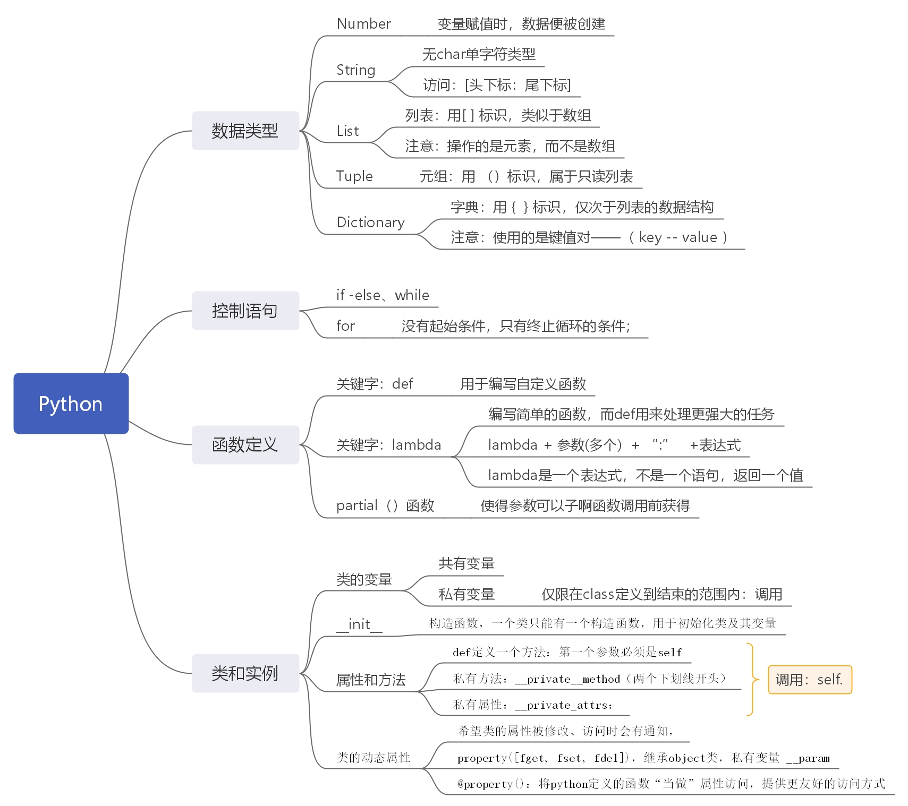
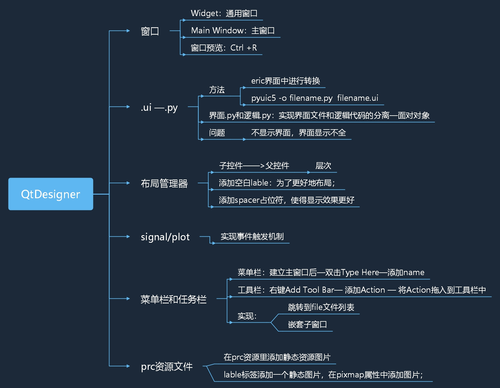
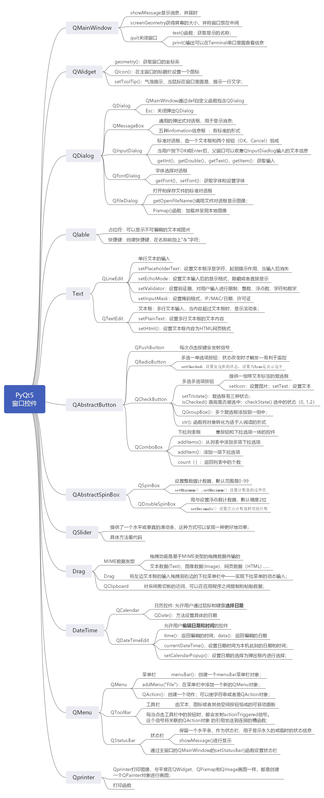

## PyQt5 书上代码

1. Chapter01

   ```
   # Eric、python、PyQt 安装后测试代码；
   ```

2. Chapter02

   +  Python的基本语法：代码需要在需要在python中进行执行，eric是是PyQt的图形输出；

   + 

3. Chapter03

   + Qt Designer 的界面使用方法；

   + 

4. Chapter04

   + PyQt5 基本窗口控件
   + 